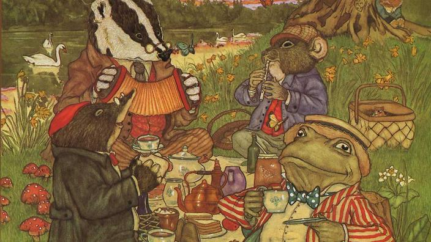

```{r setup, include= FALSE}
knitr::opts_chunk$set(echo = TRUE, warning = FALSE, error = FALSE, message = FALSE)
knitr::opts_chunk$set(echo = TRUE)
library(tidyverse)
library(tidytext)
library(textdata)
library(pdftools)
library(ggwordcloud)
library(colorspace)
library(RColorBrewer)
library(unikn)
library(jpeg)
library(ggplot2)
library(cowplot)
library(magick)
library(rasterImage)
library(plotrix)
library(plotly)
library(png)

```

# Wind in the Willows: The cheekiest book ever

#### This wild ride, is full of twists, turns and friendships. Sadly this analysis did not turn out the way I invisioned. Time has distorted my memory. Unfortunately, "ass" only appears 11 times, but in my memory and heart, it is the most important word in the entire book. 

#### I want to give a shout out to all the fathers out there, who strategically pick when to popcorn your children to read aloud the curse words in this book. 

Text was provided by:
https://freeditorial.com/en/books/the-wind-in-the-willows/related-books



```{r, cache = TRUE}
willow_text <- pdf_text("ww.pdf")

willow_tidy <- data.frame(willow_text) %>% 
  mutate(text_full = str_split(willow_text, pattern = '\\n')) %>% 
  unnest(text_full) %>% 
  mutate(text_full = str_trim(text_full)) 
```


```{r}
willow_df <- willow_tidy %>% 
  slice(-(1:4))
  

willow_tokens <- willow_df %>% 
  unnest_tokens(word, text_full) %>% 
  select(-willow_text)

willow_nonstop_words <- willow_tokens %>% 
  anti_join(stop_words)

nonstop_counts <- willow_nonstop_words %>% 
  count(word)

top_200 <- nonstop_counts %>% 
  arrange(-n) %>% 
  slice(1:200)

top_50 <- nonstop_counts %>% 
  arrange(-n) %>% 
  slice(1:50)

top_100 <- nonstop_counts %>% 
  arrange(-n) %>% 
  slice(1:100)

top_100_wo <- nonstop_counts %>% 
  arrange(-n) %>% 
  slice(1:100) %>% 
  slice(-(1:4))

top_5_words <- nonstop_counts %>% 
  arrange(-n) %>% 
  slice(1:5)

```

#### The WordCloud below shows the Top 50 words used in "Wind in the Willows". Mr. Toad, coming in at #1, is of course our wild, load and over the top friend. Rat, while less in your face as Toad, is quite the talkative fellow, coming in at #2. Mole, our sweet, shy naive friend comes in at #3.  My personal favorite, Badger comes in at #4. Although in fourth place for mentions, he is #1 in our hearts. River, home, water, animals, friends, boat and bank are all key words in painting a story about our 4 friends who live along a river. 


```{r}
ww_cloud <- ggplot(data = top_100_wo, aes(label = word)) +
  geom_text_wordcloud(aes(color = n, size = n), shape = "diamond") +
  scale_size_area(max_size = 6) +
  scale_color_gradientn(colors = c("darkgreen","blue","purple")) +
  theme_minimal()

river <- readJPEG("river.jpg")

ww_cloud_50 <- ggplot(data = top_50, aes(label = word)) +
  geom_text_wordcloud(aes(color = n, size = n), shape = "oval") +
  scale_size_area(max_size = 12) +
  scale_color_gradientn(colors = c("dodgerblue2","hotpink4", "darkgreen")) +
  theme_minimal()


ww <- ggdraw() +
  draw_image(river) +
  draw_plot(ww_cloud_50)

ww

ww_cloud_100 <- ggplot(data = top_100, aes(label = word)) +
  geom_text_wordcloud(aes(color = n, size = n), shape = "oval") +
  scale_size_area(max_size = 8) +
  scale_color_gradientn(colors = c("darkgreen","steelblue1","deepskyblue")) +
  theme_minimal()

```
### If this WordCloud intices you, I recommend reading the entire adventure!


```{r, include=FALSE}
get_sentiments(lexicon = "nrc")

get_sentiments(lexicon = "afinn")
```


## Now let's look at how the book stacks up against the Afinn Ratings


```{r}

willow_afinn <- willow_nonstop_words %>% 
  inner_join(get_sentiments("afinn"))

willow_afinn_count <- willow_afinn %>% 
  count(word, value)


willow_nrc <- willow_nonstop_words %>% 
  inner_join(get_sentiments("nrc"))

willow_nrc_counts <- willow_nrc %>% 
  count(sentiment)

#ggplot(data = willow_nrc_counts, aes(x = sentiment, y = n)) +
  #geom_col() +
  #coord_flip()

ggplot(data = willow_afinn_count, aes(x = value, y = n, fill = value), show.legend = FALSE) +
  geom_col() +
  theme_minimal() +
  scale_fill_gradient(high = 'darkgreen', low = 'darkred') +
  labs(x = "Afinn Values",
       y = "Observations",
       title = "Afinn Analysis Wind in the Willows") +
  theme(legend.position = "none") +
  theme(plot.title = element_text(size = 14,
                                   face = "bold",
        hjust = 0.5),
        axis.title.y = element_text(size = 14)) 
  
```

#### Afinn values assign values to words based on how positive or negative the word is. The scores go from -5 to 5. This is an adventure book, and with that comes ups and downs. We can see that through the break down of scores, a majority of words rating -2, but a lot of the words in the story are above 0. 

##### As for my original analysis goals, Ass scores a -4 on the Afinn, which is represented by the left most bar on the graph. 
