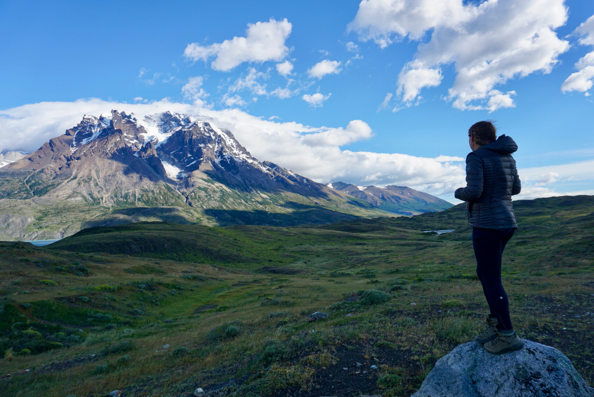
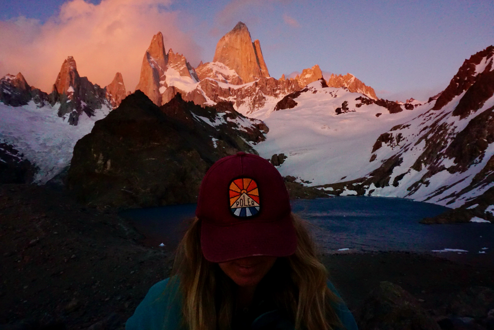
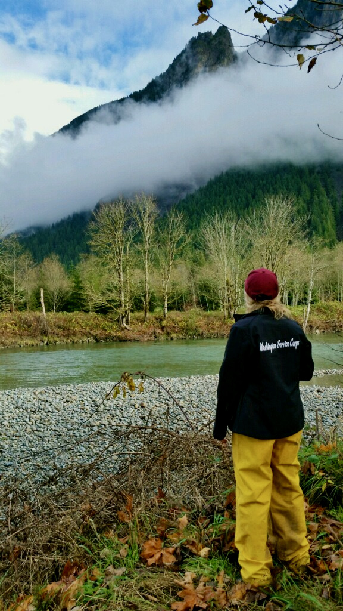
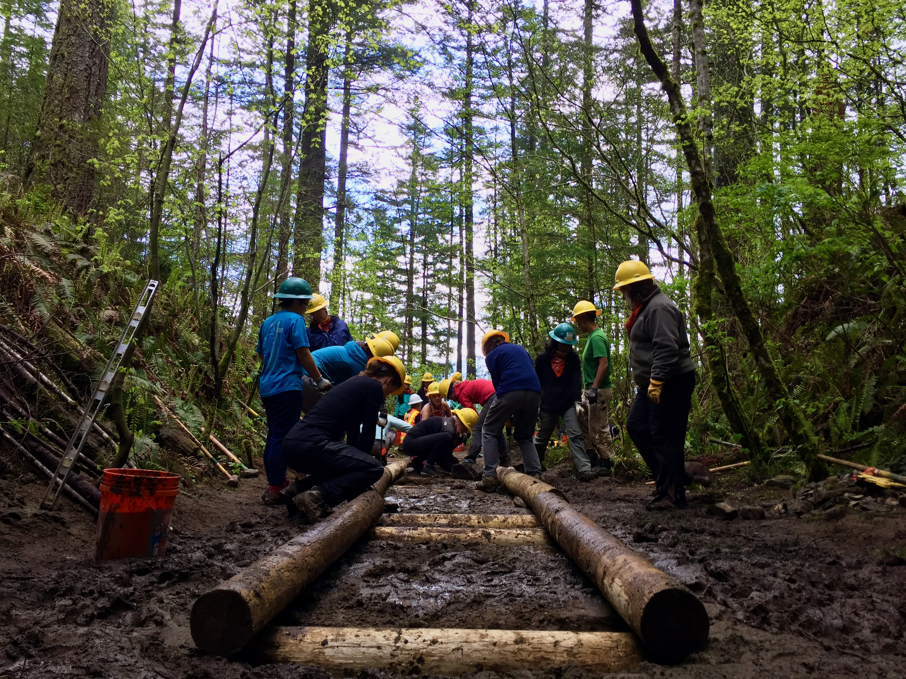
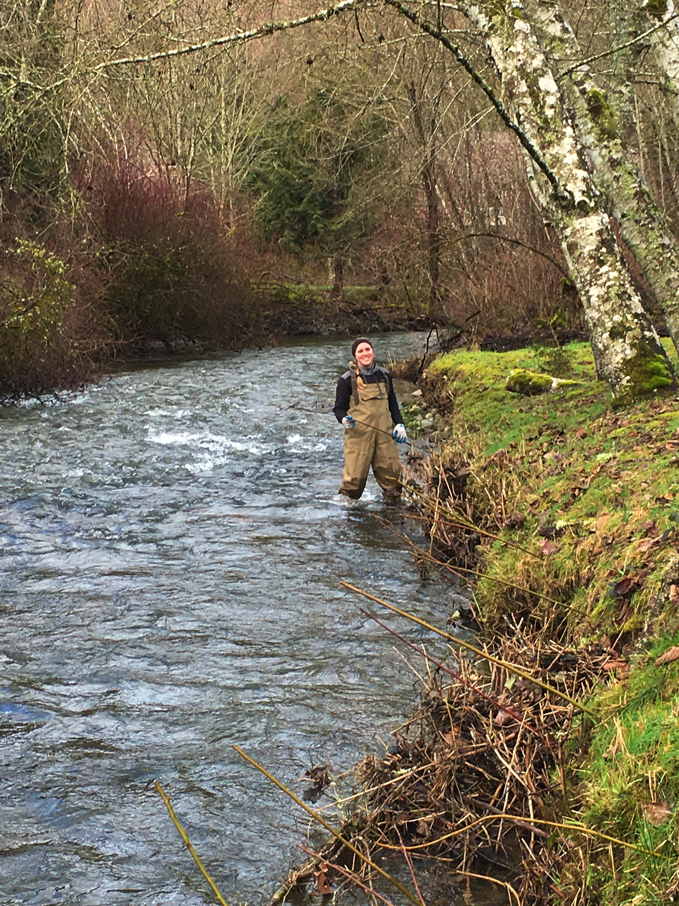
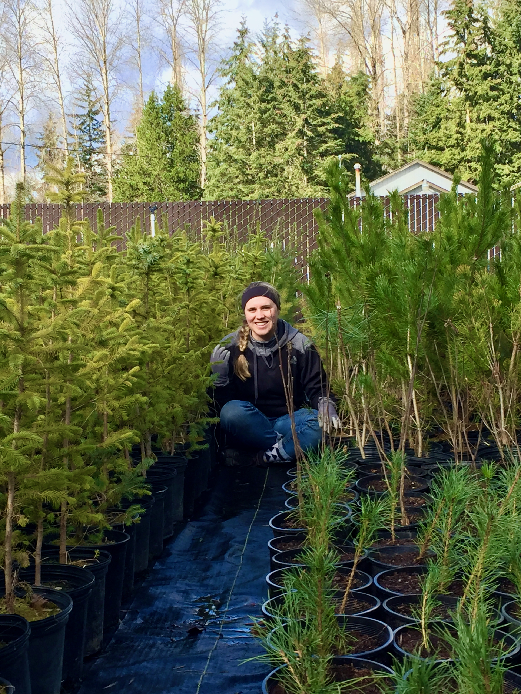

```{r setup, include=FALSE}
knitr::opts_chunk$set(echo = FALSE)
```

## Personal Background: 
I am a native Californian, who moved to the Pacific Northwest and found the extreme beauty the outdoors had to offer. I have dedicated my life to improving and protecting the outdoors. In my career I hope to make a difference in the fight against climate change. Besides loving the outdoors, I also love DOGS, SPORTS, TRAVEL and FRENCH FRIES! 

{width=100% .external}

{width=100% .external}

{width=100% .external}

{width=100% .external}

{width=100% .external}

{width=100% .external}

## Professional Interest:

#### Carbon Accounting and Supply Chain Initiatives
Through my Master's Group Project, I am able to work with a zero-waste online grocery retailer, Nada Grocery. Nada Grocery is based out of Vancouver, BC and is in the business of changing how people interact with their food. My internship focused on Supplier relations and Supplier Initiative to find out where in the supply chain data was missing. We used this information to create a comprehensive carbon footprint for both 2019 and 2020 for Nada Grocery. Through our findings, we are setting up mitigation suggestions, data management plans and supplier outreach material.

#### Retail Experience
For 2 years, I was fortunate enough to work for REI Co-op as a Sales Specialist. During this time I got to know the ins and outs of the outdoor retailer world. Though this experience I gained knowledge in sustainable clothing, gear fitting and overall outdoor outfitting. Working at REI lead me to graduate school to pursue a career in Corporate Environmental Management, with the hopes of working for a sustainable aparel company. 

{width=100% .external}

#### Field work
As a member of the Washington Service Corps, I worked as a restoration aide for the Mountains to Sound Greenway Trust. I spent the year performing in-stream surveys, trail work and restoring the natural habitat throughout the greater Seattle Area. Some of my fondest memories were running tree planting volunteer events and building new trails in the Middle Fork Wilderness Area.  

{width=100% .external}

{width=100% .external}

{width=100% .external}

{width=100% .external}

## Portfolio Examples:

